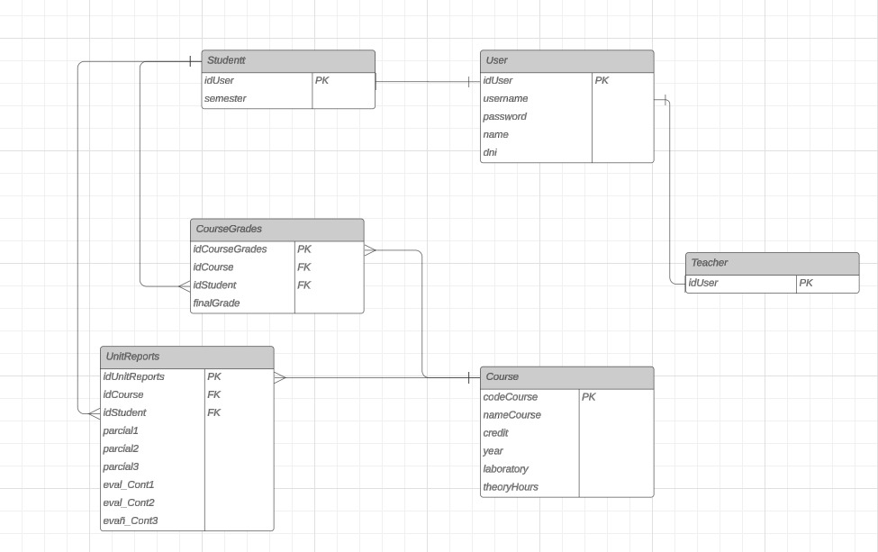

<div align="center">
<table>
    <theader>
        <tr>
            <td style="width:25%;"></td>
            <td>
                <span style="font-weight:bold;">UNIVERSIDAD NACIONAL DE SAN AGUSTIN</span><br />
                <span style="font-weight:bold;">FACULTAD DE INGENIERÍA DE PRODUCCIÓN Y SERVICIOS</span><br />
                <span style="font-weight:bold;">DEPARTAMENTO ACADÉMICO DE INGENIERÍA DE SISTEMAS E INFORMÁTICA</span><br />
                <span style="font-weight:bold;">ESCUELA PROFESIONAL DE INGENIERÍA DE SISTEMAS</span>
            </td>            
        </tr>
    </theader>
    <tbody>
        <tr>
        <td colspan="2"><span style="font-weight:bold;">Proyecto web</span>: Desarrollo de una aplicación web para visualizar el avance en la carrera</td>
        </tr>
        <tr>
        <td colspan="2"><span style="font-weight:bold;">Fecha</span>:  2024/07/28</td>
        </tr>
    </tbody>
</table>
</div>

<div align="center">
<span style="font-weight:bold;">PROYECTO WEB</span><br />
</div>


<table>
<theader>
<tr><th>INFORMACIÓN BÁSICA</th></tr>
</theader>
<tbody>
    <tr>
        <td>ASIGNATURA:</td><td>Programación Web 2</td>
    </tr>
    <tr>
        <td>SEMESTRE:</td><td>III</td>
    </tr>
    <tr>
        <td>FECHA INICIO:</td><td>17-Abr-2024</td><td>FECHA FIN:</td>
        <td>01-Ago-2024</td><td>DURACIÓN:</td><td>04 horas</td>
    </tr>
    <tr>
        <td colspan="3">DOCENTES:
        <ul>
        <li>Richart Smith Escobedo Quispe - rescobedoq@unsa.edu.pe</li>
        </ul>
        </td>
    </<tr>
</tdbody>
</table>

#   WebApp con Django

[![Git][Git]][git-site]
[![GitHub][GitHub]][github-site]

##  Tipo de Sistema
    Se trata de una aplicación web construida con el framework Django 5 y Angular para frontend, que permita la visualización de notas y avance del semestre.

##  Requisitos del sistema
    El sistema debe satisfacer los siguientes requisitos funcionales y no funcionales:

    - RQ01 : El sistema debe estar disponible en Internet a traves de una URL.
    - RQ02 : El sistema debe permitir el inicio/cierre de sesión.
    - RQ03 : El sistema debe permitir gestionar el ingreso de notas.

##  Modelo de datos
    El modelo de datos esta conformado por las siguientes entidades.

    - Curso: En esta entidad se almacena la información de los cursos o asignaturas que se imparten en una Escuela Profesional. Ejemplo: Programación Web 2,Semestre III, 02 horas teóricas, 04 horas de laboratorio, etc..
    -   Calificacion por curso de los estudiantes: En esta entidad se almacena las notas finales de los estudiantes en el semestre. Ejemplo: Programacion Web 2, 1702122, 20193200, 18, etc.
    -   Reporte de unidad : En esta entidad se almacena las notas por semestre en evaluaciones continuas y examenes. 
    -   Administrador de usuarios : En esta entidad se crea los usuarios tipo estudiante o profesor.


##  Diccionario de datos

    En la construcción de software y en el diccionario de datos sobre todo se recomienda y se utilizará el idioma inglés para especificar objetos, atributos, etc.

| Course | | | | | |
| -- | -- | -- | -- | -- | -- |
| Atributo  | Tipo  | Nulo | Clave | Predeterminado | Descripción |
| idCourse  | Numerico| No | Si | Si | Código |
| nameCourse  | Cadena| No | No | Ninguno | Nombre |
| credit | Numerico | Si | No | Ninguno | Creditos |
| prerequisite | Numerico | Si | No | No |
| semester | Numerico | Si | No | No | Semestre |
| laboratory | Booleano | Si | No | No | Laboratorio |
...

| Student | | | | | |
| -- | -- | -- | -- | -- | -- |
| Atributo  | Tipo  | Nulo | Clave | Predeterminado | Descripción |
| idStudent  | Numerico| No | Si | Ninguno | Código |
| name | Cadena| No | No | Ninguno | Nombres |
| email | Cadena| No | No | Ninguno | Correo electrónico |
| career | Cadena | No | No | No | Carrera |
... 

| Registration | | | | | |
| -- | -- | -- | -- | -- | -- |
| Atributo  | Tipo  | Nulo | Clave |Predeterminado | Descripción |
| idRegistration | Numerico | No | Si | Si | Codigo |
| student | Cadena | | | | | |
| semester | Numerico | No | No | No | Semestre |
...

| CourseGradesStudent | | | | | |
| -- | -- | -- | -- | -- | -- |
| Atributo  | Tipo  | Nulo | Clave |
Predeterminado | Descripción |
| idCourseGradesStudent | Numerico | No | Si | Si | Codigo |
| finalGrade | Numerico | Si | No | No | Calificacion fianl |
...

##  Diagrama Entidad-Relación


##  Administración con Django
    Se muestran los pasos realizados para crear el Proyecto, la aplicación, creacion de modelos, migraciones y habilitación del panel de administración en Django.
    
1. **Clonando repositorio github:**

    ```bash
    git clone https://github.com/BryanLarico/ProyectoFinal.git
    ```
2. **Creando directorio para el proyecto**
    ```bash
    mkdir TrackingNotas
    cd TrackingNotas
    ```
3. **Instalando y creando proyecto Django**
    ```bash
    pip install Django
    django-admin startproject trackingNotas
    ```
4. **Creando aplicaciones Django**
    ```bash
    mkdir myapp
    django-admin startapp myapp
    ```
5. **Creando Modelos**
    ```bash
    mkdir models
    touch Career.py Course.py CourseGradesStudent.py Event.py Grades.py Registration.py Section.py Student.py Teacher.py UnitReport.py UserManager.py
    ```   
    
     **Modelo Course.py**
    ```python
    from django.db import models
    from django.conf import settings
    from .Teacher import Teacher
    class Course(models.Model):
        idCourse = models.IntegerField(primary_key=True, unique=True)
        nameCourse = models.CharField(max_length=100, unique=True)
        credit = models.IntegerField(null=True)
        prerequisite = models.IntegerField(null=True, blank=True)
        semester = models.IntegerField(null=True)
        laboratory = models.BooleanField(null=True, blank=True)
        hoursTeory = models.IntegerField(null=True, blank=True)
        hoursPractice = models.IntegerField(null=True, blank=True)
        p1 = models.IntegerField(null=True)
        p2 = models.IntegerField(null=True)
        p3 = models.IntegerField(null=True)
        e1 = models.IntegerField(null=True)
        e2 = models.IntegerField(null=True)
        e3 = models.IntegerField(null=True)
        status = models.BooleanField(null=True)
        created = models.DateTimeField(auto_now_add=True)
        modified = models.DateTimeField(auto_now=True)
        id_user_created = models.ForeignKey(
            settings.AUTH_USER_MODEL, related_name='course_created', 
            on_delete=models.SET_NULL, null=True, 
            blank=True)
        id_user_modified = models.ForeignKey(
            settings.AUTH_USER_MODEL, related_name='course_modified',
            on_delete=models.SET_NULL, null=True, 
            blank=True)

        def __str__(self):
            return "%s" % (self.nameCourse)
    ```
    **Modelo ReportUnit.py**
    ```python 
    from django.db import models
    from django.core.validators import MinValueValidator, MaxValueValidator
    from django.conf import settings
    from .Course import Course
    from .Event import Event
    from .UserManager import User, UserManager

    class UnitReport(models.Model):
        idUnitReport = models.AutoField(primary_key=True)
        idCourse = models.ForeignKey(Course, on_delete=models.CASCADE, null=True)
        username = models.ForeignKey(User, on_delete=models.CASCADE, null=True)
        eval_cont1 = models.FloatField(null=True, blank=True, validators=[
            MinValueValidator(0),
            MaxValueValidator(20)
        ])
        parcial1 = models.FloatField(null=True, blank=True, validators=[
            MinValueValidator(0),
            MaxValueValidator(20)
        ])
        eval_cont2 = models.FloatField(null=True, blank=True, validators=[
            MinValueValidator(0),
            MaxValueValidator(20)
        ])
        parcial2 = models.FloatField(null=True, blank=True, validators=[
            MinValueValidator(0),
            MaxValueValidator(20)
        ])
        eval_cont3 = models.FloatField(null=True, blank=True, validators=[
            MinValueValidator(0),
            MaxValueValidator(20)
        ])
        parcial3 = models.FloatField(null=True, blank=True, validators=[
            MinValueValidator(0),
            MaxValueValidator(20)
        ])

        def __str__(self):
            return f"Unit Report for Course: {self.idCourse.nameCourse} and User: {self.username.username}"
    ```
6. **Registrando modelos**
    ```bash
    En admin.py
    ```
    ```python
    from django.contrib import admin
    from django.conf import settings
    from django.contrib.auth import get_user_model
    from .models.Career import Career
    from .models.Course import Course
    from .models.Event import Event
    from .models.Grades import Grades
    from .models.Registration import Registration
    from .models.Section import Section
    from .models.Student import Student
    from .models.Teacher import Teacher
    from .models.UnitReport import UnitReport
    from .models.CourseGradesStudent import CourseGradesStudent
    from .models.UserManager import User, UserManager

    #CustomUser = get_user_model()

    class BaseAdmin(admin.ModelAdmin):
        exclude = ('id_user_created', 'id_user_modified')

        def save_model(self, request, obj, form, change):
            if not change or not obj.id_user_created:
                obj.id_user_created = request.user
            obj.id_user_modified = request.user
            super().save_model(request, obj, form, change)
    
    class UserAdmin(admin.ModelAdmin):
        list_display = ('username', 'email', 'user_type', 'semester', 'name', 'dni', 'registration_date', 'usuario_activo', 'usuario_teacher')
        search_fields = ('username', 'email', 'semeste', 'name', 'dni')
        list_filter = ('user_type', 'usuario_activo', 'usuario_teacher')
    
    class UserManagerAdmin(BaseAdmin):
        list_display: ['username', 'email', 'password']

    class CourseAdmin(BaseAdmin):
        list_display = ['idCourse', 'nameCourse', 'credit', 'prerequisite', 'semester', 'laboratory', 'hoursTeory', 'hoursPractice', 'p1', 'p2', 'p3', 'e1', 'e2', 'e3', 'status', 'created', 'modified']

    class CourseGradesStudentAdmin(BaseAdmin):
        list_display = ['idCourseGradesStudent', 'idCourse', 'idStudent', 'finalGrade', 'created', 'modified']
        
    class EventAdmin(BaseAdmin):
        list_display = ['idEvent', 'idCourse', 'amountEvent', 'percentageProgress', 'percentageExam', 'created', 'modified']

    class RegistrationAdmin(BaseAdmin):
        list_display = ['idRegistration', 'student', 'semester', 'created', 'modified']

    class SectionAdmin(BaseAdmin):
        list_display = ['course', 'group', 'capacity', 'created', 'modified']

    class StudentAdmin(BaseAdmin):
        list_display = ['idStudent', 'email', 'password', 'name', 'career', 'phone', 'created', 'modified']

    class TeacherAdmin(BaseAdmin):
        list_display = ['idTeacher', 'email', 'password', 'name', 'phone', 'created', 'modified']

    class GradesAdmin(BaseAdmin):
        list_display = ['idGrades', 'idRegistration', 'idEvent', 'progress', 'exam', 'average', 'created', 'modified']

    class CareerAdmin(BaseAdmin):
        list_display = ['idCareer', 'nameCareer', 'created', 'modified']

    class UnitReportAdmin(BaseAdmin):
        list_display = ['idUnitReport', 'idCourse', 'username', 'eval_cont1', 'parcial1', 'eval_cont2', 'parcial2', 'eval_cont3', 'parcial3']

    admin.site.register(Course, CourseAdmin)
    admin.site.register(Event, EventAdmin)
    admin.site.register(Registration, RegistrationAdmin)
    admin.site.register(Section, SectionAdmin)
    admin.site.register(Student, StudentAdmin)
    admin.site.register(Teacher, TeacherAdmin)
    admin.site.register(Grades, GradesAdmin)
    admin.site.register(Career, CareerAdmin)
    admin.site.register(UnitReport, UnitReportAdmin)
    admin.site.register(CourseGradesStudent, CourseGradesStudentAdmin)
    #admin.site.register(UserManager, User)
    ```
    ![Django admin] ()

7. **Configurar el Proyecto Django**
    ```bash
    En settings.py
    ```
    ```python
    """
    Django settings for TrackingNotas project.

    Generated by 'django-admin startproject' using Django 5.0.6.
    """

    from pathlib import Path
    from django.conf import settings
    from datetime import timedelta
    import os

    # Build paths inside the project like this: BASE_DIR / 'subdir'.
    BASE_DIR = Path(__file__).resolve().parent.parent

    # Quick-start development settings - unsuitable for production
    # See https://docs.djangoproject.com/en/5.0/howto/deployment/checklist/

    # SECURITY WARNING: keep the secret key used in production secret!
    SECRET_KEY = 'django-insecure-q!k!ee2z4w$3g*7iqit*mb#miqv05%15lv=eux&s^20her_@9v'

    # SECURITY WARNING: don't run with debug turned on in production!
    DEBUG = True

    ALLOWED_HOSTS = []
    # Application definition

    INSTALLED_APPS = [
        'django.contrib.admin',
        'django.contrib.auth',
        'django.contrib.contenttypes',
        'django.contrib.sessions',
        'django.contrib.messages',
        'django.contrib.staticfiles',
        'myapp',
        'rest_framework',
        'rest_framework_simplejwt',
        'rest_framework_simplejwt.token_blacklist',
        'drf_yasg',
        'corsheaders',
        'rest_framework.authtoken',
    ]

    MIDDLEWARE = [
        'corsheaders.middleware.CorsMiddleware',
        'django.middleware.security.SecurityMiddleware',
        'django.contrib.sessions.middleware.SessionMiddleware',  # Esto debe estar antes de AuthenticationMiddleware
        'django.middleware.common.CommonMiddleware',
        'django.middleware.csrf.CsrfViewMiddleware',
        'django.contrib.auth.middleware.AuthenticationMiddleware',  # Este middleware es requerido
        'django.contrib.messages.middleware.MessageMiddleware',  # Este middleware es requerido
        'django.middleware.clickjacking.XFrameOptionsMiddleware',
    ]

    CORS_ALLOW_ALL_ORIGINS = True

    # CORS_ALLOWED_ORIGINS = [
    #     "http://localhost:4200",
    # ]

    ROOT_URLCONF = 'TrackingNotas.urls'

    TEMPLATES = [
        {
            'BACKEND': 'django.template.backends.django.DjangoTemplates',
            'DIRS': [],
            'APP_DIRS': True,
            'OPTIONS': {
                'context_processors': [
                    'django.template.context_processors.debug',
                    'django.template.context_processors.request',
                    'django.contrib.auth.context_processors.auth',
                    'django.contrib.messages.context_processors.messages',
                ],
            },
        },
    ]

    WSGI_APPLICATION = 'TrackingNotas.wsgi.application'


    # Database
    # https://docs.djangoproject.com/en/5.0/ref/settings/#databases

    DATABASES = {
        'default': {
            'ENGINE': 'django.db.backends.sqlite3',
            'NAME': BASE_DIR / 'db.sqlite3',
        }
    }


    # Password validation
    # https://docs.djangoproject.com/en/5.0/ref/settings/#auth-password-validators

    AUTH_PASSWORD_VALIDATORS = [
        {
            'NAME': 'django.contrib.auth.password_validation.UserAttributeSimilarityValidator',
        },
        {
            'NAME': 'django.contrib.auth.password_validation.MinimumLengthValidator',
        },
        {
            'NAME': 'django.contrib.auth.password_validation.CommonPasswordValidator',
        },
        {
            'NAME': 'django.contrib.auth.password_validation.NumericPasswordValidator',
        },
    ]


    # Internationalization
    # https://docs.djangoproject.com/en/5.0/topics/i18n/

    LANGUAGE_CODE = 'es-PE'

    TIME_ZONE = 'America/Lima'

    USE_I18N = True

    USE_TZ = True

    # Static files (CSS, JavaScript, Images)
    # https://docs.djangoproject.com/en/5.0/howto/static-files/

    STATIC_URL = 'static/'

    # Default primary key field type
    # https://docs.djangoproject.com/en/5.0/ref/settings/#default-auto-field

    DEFAULT_AUTO_FIELD = 'django.db.models.BigAutoField'

    REST_FRAMEWORK = {
        'DEFAULT_AUTHENTICATION_CLASSES': (
            'rest_framework_simplejwt.authentication.JWTAuthentication',
        ),
        'DEFAULT_PERMISSION_CLASSES': (
            'rest_framework.permissions.IsAuthenticated',
        ),
    }

    SIMPLE_JWT = {
        'ACCESS_TOKEN_LIFETIME': timedelta(minutes=15), 
        'REFRESH_TOKEN_LIFETIME': timedelta(days=1), 
        'ROTATE_REFRESH_TOKENS': True,
        'BLACKLIST_AFTER_ROTATION': True,
        'AUTH_HEADER_TYPES': ('Bearer',),
        'AUTH_TOKEN_CLASSES': ('rest_framework_simplejwt.tokens.AccessToken',),
    }

    AUTH_USER_MODEL = 'myapp.User'
    ```

##  CRUD - Core Business - Clientes finales
    El núcleo de negocio del sistema de inscripciones tiene valor de aceptación para los cliente finales (alumnos) radica en realizar el proceso de inscripción propiamente, que empieza desde que:
    1. El alumno se registra.
    2. El alumno inicia sesion.
    3. Se autentica el alumno y se obtiene token JWT.
    4. El alumno gestiona sus cursos.
    5. El alumno guarda su promedio.
    6. El alumno cierra sesión.

    A continuación se muestran las actividades realizadas para su construcción:

 **Fronted con Angular**

1. **Crear directorio para frontend**
    ```bash
    \ProyectoFinal
    mkdir FRONTEND
    cd FRONTEND
    mkdir TrackingNotas
    cd TrackingNotas
    npm install .g @angular/cli
    ```
2. **Crear componentes para el proyecto**
    ```bash
    cd src/app
    ng new auth #log-in y sing-in
    ng new book-grades #notas por curso
    ng new semester-grades #notas generales
    ```
3. **Visualizacion de la web**
    Pagina de Inicio: 
<div class="row">


</div>
<!---->
    Despues de iniciar sesion:
<div class="row">


</div>

##  Servicios mediante una API RESTful

    Se ha creado una aplicación que pondra a disposición cierta información para ser consumida por otros clientes HTTP.
    1. GET : Con el método get se devolverá informacion del usuario para listar o detallar elementos. En formato JSON. 
    2. POST : Con este método se enviara datos al servidor, generalmente para crear nuevos cursos. En formato JSON.

##  Investigación: serializer.py, urls.py
1. **Estructura de la API y serializacion de datos**
    Utilizando Django y Django REST Framework (DRF) para construir nuestra API, lo que permite convertir datos en representaciones JSON y viceversa:
    -Usuarios: Creación, edición, autenticación, y gestión de perfiles de usuario.
    -Entidades Académicas: Incluye modelos como carreras, cursos, estudiantes, profesores, y registros de calificaciones.
    -Informes y Eventos: Gestión de informes de unidades y eventos académicos.

2. **Autenticacion y seguridad**
    Implementamos la autenticacion basada en JWT (JSON Web Tokens) para asegurar que solo los usuarios autenticados puedan acceder a ciertos recursos. Esto se gestiona mediante vistas y serializars personalizados, como 'CustomTokenObtainPairSerializar', que maneja el proceso de generación de tokens y validacion de credenciales de usuarios.


Github del proyecto: https://github.com/BryanLarico/ProyectoFinal.git

URL en Render: https://2xqwwg3c-4200.brs.devtunnels.ms/home 


URL Playlist YouTube. [![YouTube][YouTube]][youtube-playlist]
Producción de un PlayList en YouTube explicando cada uno de los requerimientos:

- Video 01 - Presentación de la página web
- Video 02 - Registro de usuario
- Video 03 - Inicio de sesión
- Video 04 - Calcular y guardar notas


[Git]: https://img.shields.io/badge/git-%23F05033.svg?style=for-the-badge&logo=git&logoColor=white
[git-site]: https://git-scm.com/

[GitHub]: https://img.shields.io/badge/github-%23121011.svg?style=for-the-badge&logo=github&logoColor=white
[github-site]: https://github.com/

[Youtube]: https://img.shields.io/badge/YouTube-FF0000?style=for-the-badge&logo=youtube&logoColor=white
[youtube-playlist]: https://www.youtube.com/playlist?list=PLV61dGfGJpZB4rNfF65R5O_BybVF7HzGQ

[![YouTube][YouTube]][youtube-playlist]
[![Git][Git]][git-site]
[![GitHub][GitHub]][github-site]